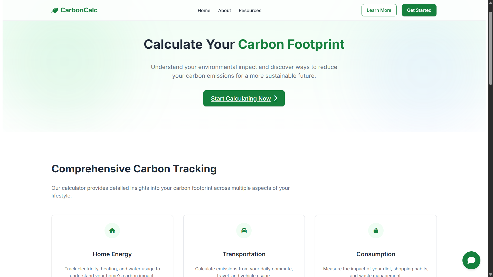
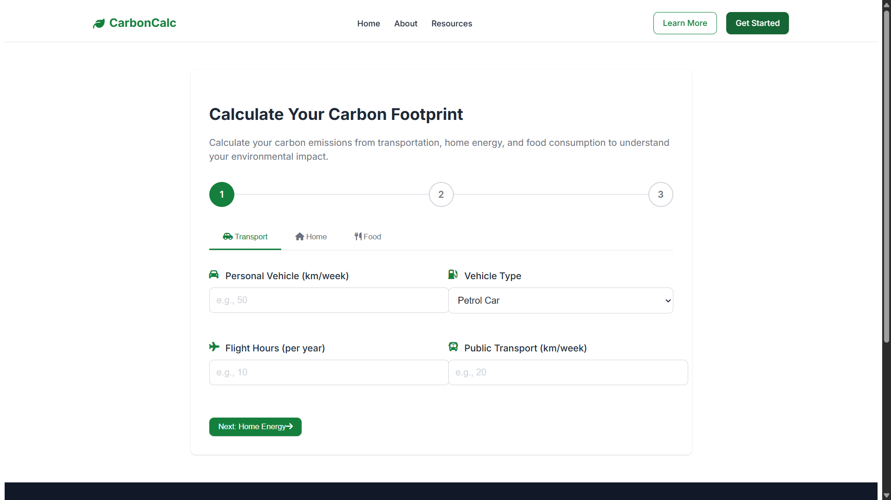
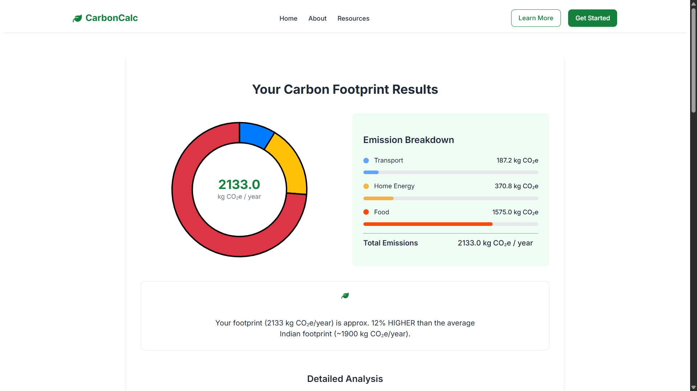
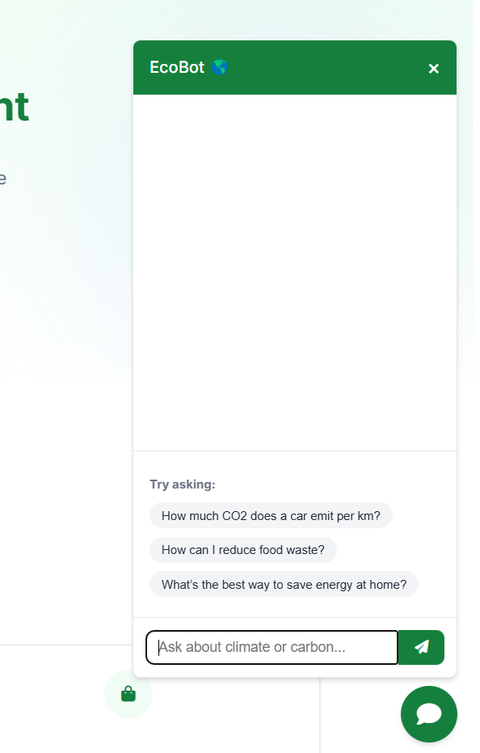

# CarbonCalc: Carbon Footprint Tracker + AI Advisor

> A lightweight web app to help individuals measure, understand, and reduce their carbon footprint — powered by Google Gemini AI.

---

## 📜 Table of Contents
- [About the Project](#about-the-project)
- [Features](#features)
- [Tech Stack](#tech-stack)
- [How It Works](#how-it-works)
- [Setup Instructions](#setup-instructions)
- [Screenshots](#screenshots)
- [Future Improvements](#future-improvements)
- [License](#license)

---

## 📖 About the Project

Climate change is a global emergency, and individual actions matter!  
**CarbonCalc** empowers users to calculate their personal carbon footprint based on **Transport**, **Home Energy**, and **Food Habits** — and provides **AI-generated suggestions** for living a greener life.

---

## ✨ Features

- 🚗 **Transport, Home, and Food Emission Calculator**  
- 📊 **Visual Charts** (Breakdown, Monthly Trend, Global Comparison)
- 🤖 **EcoBot AI Chatbot** — Personalized tips and guidance
- 📈 **“What NOT to do” advice** generated by AI
- 🧠 **Simple, beginner-friendly UI** (No technical jargon)
- 🛡️ **Privacy-focused** — No login required, no user tracking
- 🌎 **Designed for Indian and Global Users**


---

## ⚙️ Tech Stack

| Frontend | AI Integration |
|-----------|----------------|
| HTML, CSS, JavaScript | Google Gemini API (free version) |
| Chart.js for data visualization | | |

---

## 🛠️ How It Works

1. User fills out basic transport, energy, and food information.
2. App calculates annual CO₂ emissions.
3. Gemini AI provides:
   - Personalized tips for improvement
   - Things to avoid
   - Interactive chatbot support
4. Visual charts show user’s footprint compared to national/global averages.

---

## 🖥️ Setup Instructions

```bash
# Clone the repo
git clone https://github.com/your-username/CarbonCalc.git

# Open index.html in your browser
```

- In `script.js`,`landing.js` replace `YOUR_API_KEY_HERE` with your key.

---

## 📸 Screenshots

| Landing Page | Footprint Form | Results Page | EcoBot Chat |
|--------------|----------------|--------------|-------------|
|  |  |  |  |


---

## 🌱 Future Improvements

- User accounts and footprint history
- Regional language translations
- Gamification (Green badges, challenges)
- Smart notifications (“Hey! You beat your last month's footprint!”)

---

## 📄 License

This project is licensed under the [MIT License](LICENSE).

---

# 🌟 Made with ❤️ by Team Code Climbers 🌟
- Team Members : \
[Mohd Sarfraz](https://github.com/mohdsarfraz08) [Md Affan Ali](https://github.com/iaffaan) [Dayanand Gupta](https://github.com/Dayanand6528) 
